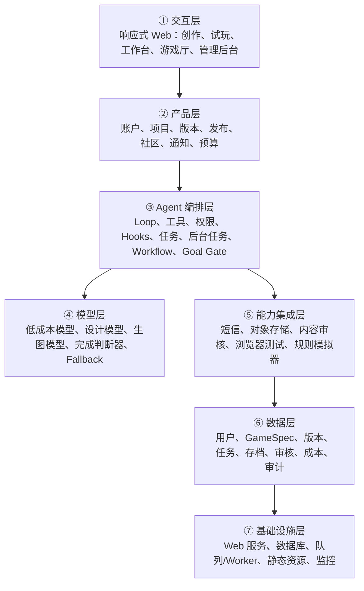

# AI 模拟器游戏平台 MVP 产品需求文档

> 工作名称：AI 模拟器游戏平台（正式名称待定）  
> 文档版本：v1.0  
> 日期：2026-09-22  
> 产品阶段：10～20 人封闭测试  
> 需求状态：已完成产品访谈，可进入架构方案设计  
> 推导方式：当前 AI 按 Agent Blueprint 手册分析；引擎未配置外部模型接口，未运行模型管线，未生成 `plan.json`，也未声称通过独立模型审稿。

---

## 1. 一句话定位

面向不会编程的大众和内容创作者，让用户用中文描述任意题材，经 AI 追问和方案确认后，生成一款可以在手机及电脑浏览器中直接游玩的轻量 2D 模拟器，并支持修改、发布、分享和“做同款”。

## 2. 产品背景与判断

现有 AI 游戏生成平台倾向强调“任意品类、一句话生成”。首版若同时支持射击、动作、平台跳跃、多人和 3D 物理，需要维护多套玩法系统、编辑方式和质量标准，生成稳定性与测试成本都会失控。

本产品选择“任意题材、统一模拟器机制”的切入口。题材可以是人生、职业、经营、生存、恋爱、古代身份、社会实验等；底层玩法统一由数值、选项、事件、时间推进和结局组成，并按需启用任务、地点、关系、背包、经营和成长模块。

AI 负责理解需求、设计内容、生成结构化规则、辅助修改、生成少量视觉资产及执行质量判断。固定模拟器引擎负责运行规则，不执行 AI 生成的任意代码。这是首版成功率、成本、安全和可维护性的核心约束。

## 3. 目标与非目标

### 3.1 MVP 目标

1. 让不会编程的用户完成从想法到可玩模拟器的全过程。
2. 用户在生成前能看懂并确认游戏方案。
3. 生成过程透明，用户能看到真实阶段、结果与失败原因。
4. 生成结果默认私有，可试玩、对话修改、回退版本。
5. 用户主动发布且审核通过后，作品进入公共游戏厅。
6. 玩家可免登录试玩，登录后可互动、创作和保存。
7. 首发通过 12 款示范游戏展示题材跨度与“做同款”能力。
8. 10～20 人、每月不超过约 30 款游戏的封闭测试，总运行费用控制在 100 元以内。

### 3.2 首版非目标

- 不生成动作、射击、平台跳跃、实时战斗或复杂物理游戏。
- 不支持高精度驾驶、飞行或大型实时多人游戏。
- 不执行 AI 生成的 JavaScript、脚本或插件。
- 不支持用户上传参考图、角色素材包或其他文件。
- 不做应用商店原生 App，先做响应式网页。
- 不做付费、订阅、创作者分成或广告。
- 不做跨游戏用户偏好记忆。
- 不做实时协作编辑、多人联机或开放插件市场。
- 不以封闭测试方案代替正式公开运营所需的合规评估。

## 4. 用户与使用场景

### 4.1 核心用户

**大众创作者**

- 不会编程，也不了解游戏引擎。
- 使用过常见 AI 对话产品，能用自然语言描述想法。
- 想制作打工、人生、经营、恋爱、生存等“小工具式模拟器”。
- 最关心能不能做出来、能不能玩、能不能继续改。

**内容创作者**

- 希望把账号主题、热点或粉丝梗做成互动模拟器。
- 需要独立分享链接、封面和适合手机竖屏的体验。
- 可能基于已有模板快速改编并发布。

**普通玩家**

- 从分享链接或游戏厅进入。
- 不登录即可试玩。
- 登录后可点赞、收藏、评论、关注作者或“做同款”。

**平台管理员**

- 管理用户、作品、生成任务、审核、举报、成本和故障。
- 可下架作品、隐藏评论和封禁账号，操作需要审计。

### 4.2 核心痛点

- 普通人有创意但不会代码、美术和数值设计。
- 一句话直接生成的结果容易偏离预期，因此需要先澄清和确认。
- AI 修改可能破坏原本可玩的版本，因此需要版本历史和回退。
- 公共 UGC 容易出现违规、侵权和低质量内容，因此发布前要审核。
- 冷启动用户少，平台需要用自制示范游戏建立内容密度与创作参考。

## 5. MVP 成功定义与指标

### 5.1 单款游戏“成功生成”的产品定义

同时满足以下条件才算成功：

1. 游戏可在支持的浏览器中正常加载。
2. 玩家可以完成至少一轮核心玩法。
3. 没有阻止玩家继续操作的错误。
4. 当前版本可以继续通过自然语言修改。
5. 生成过程、测试结果和版本号已记录。

### 5.2 封闭测试建议指标

下列数值是 MVP 初始目标，测试后校准：

| 指标 | 目标 |
|---|---:|
| 方案确认后任务技术完成率 | ≥ 85%（含自动重试） |
| 真正达到“成功生成”定义的比例 | ≥ 70% |
| 经一次修改或重试后的累计成功率 | ≥ 85% |
| 用户完成一次核心玩法的比例 | ≥ 70% |
| P50 生成耗时 | ≤ 5 分钟 |
| P90 生成耗时 | ≤ 10 分钟 |
| 失败任务有明确原因与可操作恢复入口 | 100% |
| 单款游戏平均可变成本 | ≤ 2 元 |
| 月度全部测试运行费用 | ≤ 100 元 |
| 公开作品审核覆盖率 | 100% |

首要北极星指标：**成功生成游戏数 / 已确认并启动生成的游戏数**。

## 6. 产品原则

1. **确认后再生成**：AI 先问清需求并给出结构化方案，用户明确确认后才消耗生成资源。
2. **可玩优先**：先完成规则与可玩性验证，再生成图片。
3. **引擎确定性优先**：规则由固定引擎执行，模型不直接运行任意代码。
4. **失败不覆盖成功**：任何生成或修改失败都不破坏当前可玩版本。
5. **阶段透明**：展示真实任务阶段、产物、错误和验证结果，不展示隐藏思维过程，也不伪造进度百分比。
6. **发布由用户决定**：生成结果默认私有，公开发布必须由用户主动触发。
7. **审核在发布之前**：未通过审核的内容保持私有并给出修改指引。
8. **成本可中止**：每个任务和每月都有预算上限，到达阈值后停止新增消耗。

## 7. 核心用户旅程

### 7.1 创作主流程

1. 用户进入创作页，可先以游客身份使用。
2. 输入一句话想法，例如“做一个在三线城市开宠物店的模拟器”。
3. AI 根据缺失信息提出 3～7 个短问题，逐步确认身份、目标、时间推进、主要数值、失败条件、画面氛围和期望时长。
4. AI 生成可读的游戏方案卡，包含核心循环、属性、模块、事件方向、结局与视觉方案。
5. 用户修改或点击“确认并生成”。
6. 系统创建后台任务，持久化输入、确认方案、预算和任务状态。
7. 系统按阶段生成并显示进展：规则整理、内容生成、引擎组装、自动试玩、视觉生成、最终检查。
8. 成功后建立 v1 私有版本，用户进入试玩。
9. 用户通过自然语言提出修改，系统显示影响范围并生成新版本。
10. 用户选择一个可玩版本，点击发布。
11. 系统执行文本、图片和规则审核；通过后进入游戏厅。

### 7.2 游玩与社区流程

1. 玩家从独立链接或游戏厅进入作品。
2. 未登录也能直接开始新存档并完成一轮玩法。
3. 本机可临时保存匿名进度；跨设备保存需登录。
4. 登录用户可以点赞、收藏、评论、关注作者、分享和“做同款”。
5. “做同款”创建新的私有项目，复制允许复用的结构化规则与素材引用，并记录源作品和原作者。
6. 派生作品需重新审核，不能继承源作品的审核通过状态。

### 7.3 失败恢复流程

- 模型请求失败：在预算允许范围内自动重试一次，仍失败则保留任务与已完成阶段，允许用户手动继续。
- 结构化输出不合法：使用 schema 错误信息要求模型修复一次；仍失败则终止该阶段。
- 生图失败：降级为平台默认主题素材，不阻止游戏成为可玩版本。
- 自动试玩失败：返回具体失败项，自动修正规则一次；仍不通过则任务标记“需要修改”，不发布。
- 审核服务不可用：发布请求进入待审核状态，默认不公开。
- 达到月度预算：禁止启动新生成，已有游戏仍可试玩、管理和分享已发布版本。

## 8. 信息架构与页面

### 8.1 用户侧页面

1. **首页 / 游戏厅**：编辑推荐、题材合集、新手模板、精选作品、搜索。
2. **创作页**：想法输入、AI 澄清对话、方案卡、确认门。
3. **生成任务页**：阶段进度、已生成产物、耗时、失败原因、取消与重试。
4. **游戏工作台**：试玩区、修改对话、版本历史、方案与规则摘要、发布入口。
5. **游戏详情页**：游戏画面、标题、作者、来源、版本、介绍、互动、做同款、相关推荐。
6. **我的游戏**：草稿、生成中、待修改、审核中、已发布、已下架。
7. **通知中心**：生成完成、生成失败、审核结果、评论和关注提醒。
8. **个人主页**：已发布作品、收藏、关注与基础资料。
9. **登录与账户页**：游客状态、手机号首次验证、设置密码、密码登录、忘记密码、成年声明。

### 8.2 管理后台

1. 数据概览：用户数、生成任务、成功率、作品数、审核量、模型和短信费用。
2. 用户管理：状态、作品、违规记录、封禁与解封。
3. 作品管理：私有/公开状态、版本、来源、审核记录、下架。
4. 内容审核：文本、图片、评论、模型建议、人工复核。
5. 任务中心：阶段、耗时、失败点、重试次数、单任务成本。
6. 模型配置：供应商、模型、用途、限额、熔断和 fallback。
7. 预算中心：日/月预算、预警线、暂停开关和账单记录。
8. 推荐运营：示范游戏、题材合集、精选位和排序。
9. 审计日志：管理员和系统的重要操作记录。

## 9. 功能需求

优先级定义：P0 为封闭测试必须，P1 为首版增强，P2 为第二期。

### 9.1 账户与身份

| ID | 需求 | 优先级 | 验收要点 |
|---|---|---|---|
| ACC-01 | 游客无需登录即可开始创作和试玩 | P0 | 页面刷新后在同一设备可恢复未过期的游客会话 |
| ACC-02 | 保存云端或发布时要求手机号验证码 | P0 | 验证码限频，成功后设置密码 |
| ACC-03 | 日常使用手机号和密码登录 | P0 | 密码加密存储，支持安全退出 |
| ACC-04 | 忘记密码使用短信验证码重置 | P0 | 重置后旧会话失效 |
| ACC-05 | 注册和首次保存时要求勾选成年声明及协议 | P0 | 未勾选不能继续 |
| ACC-06 | 微信登录 | P2 | 预留账户绑定接口，不进入 MVP |

### 9.2 AI 需求澄清与方案确认

| ID | 需求 | 优先级 | 验收要点 |
|---|---|---|---|
| CRT-01 | 接受中文自然语言游戏想法 | P0 | 空输入、过长输入和违规输入有明确提示 |
| CRT-02 | AI 根据缺口动态追问 | P0 | 问题数量通常 3～7 个，可跳过非关键问题 |
| CRT-03 | 输出结构化方案卡 | P0 | 必含身份、目标、核心循环、属性、事件、模块、结局、预计时长和视觉方向 |
| CRT-04 | 用户可修改方案 | P0 | 修改后重新生成方案摘要，不启动正式生成 |
| CRT-05 | 明确确认门 | P0 | 只有点击“确认并生成”才创建付费生成任务 |
| CRT-06 | 展示预计耗时和预计消耗 | P1 | 估算超出用户或系统额度时禁止启动 |

### 9.3 模拟器规则引擎

| ID | 需求 | 优先级 | 验收要点 |
|---|---|---|---|
| ENG-01 | 基础回合与时间推进 | P0 | 支持天、周、月或自定义回合单位 |
| ENG-02 | 属性与资源系统 | P0 | 支持初始值、上下限、显示方式和增减效果 |
| ENG-03 | 条件、选项与效果 | P0 | 支持布尔条件、数值比较、概率、状态标记和组合效果 |
| ENG-04 | 事件系统 | P0 | 支持固定、条件、随机、冷却、一次性及事件链 |
| ENG-05 | 结局系统 | P0 | 支持成功、失败和多种隐藏结局，条件可验证 |
| ENG-06 | 存档 | P0 | 匿名本地存档；登录后可云端存档 |
| ENG-07 | 任务模块 | P1 | 任务条件、进度、奖励与失败 |
| ENG-08 | 地点模块 | P1 | 地点解锁、可用行动和地点事件池 |
| ENG-09 | 关系模块 | P1 | NPC 关系值、状态、事件与结局条件 |
| ENG-10 | 背包与经营模块 | P1 | 物品、价格、库存、收入、支出和升级 |
| ENG-11 | 任意代码隔离 | P0 | schema 不允许脚本字段，渲染器不使用 `eval` 或动态执行用户内容 |

### 9.4 后台生成与进度

| ID | 需求 | 优先级 | 验收要点 |
|---|---|---|---|
| JOB-01 | 生成任务持久化 | P0 | 离开页面或服务重启后可查询状态和继续 |
| JOB-02 | 显示真实阶段 | P0 | 阶段来自任务事件，不用虚假线性百分比 |
| JOB-03 | 阶段结果可检查 | P0 | 可查看方案、规则校验、测试摘要和图片结果 |
| JOB-04 | 支持取消 | P1 | 取消后不再启动新调用，已产生费用被记录 |
| JOB-05 | 幂等重试 | P0 | 同一阶段重复请求不能创建重复版本或重复发布 |
| JOB-06 | 预算检查 | P0 | 任务启动前及每次外部调用前检查剩余额度 |

任务阶段：

`draft → clarifying → awaiting_confirmation → queued → generating_rules → validating_schema → generating_content → assembling → auto_testing → generating_visuals → final_check → completed`

异常状态：`needs_revision`、`failed`、`cancelled`、`budget_blocked`。

### 9.5 自动试玩与完成判断

| ID | 需求 | 优先级 | 验收要点 |
|---|---|---|---|
| QA-01 | schema 校验 | P0 | 字段、类型、引用和限制全部通过 |
| QA-02 | 引用完整性检查 | P0 | 事件、角色、地点、任务和结局引用不存在悬空对象 |
| QA-03 | 规则模拟 | P0 | 运行多条自动路径，检查是否能推进、是否立即死局、资源是否越界 |
| QA-04 | 结局可达性 | P0 | 至少一个有效结局可从初始状态到达 |
| QA-05 | 浏览器冒烟测试 | P0 | 首屏加载、开始游戏、选择一次、存档和恢复无阻断错误 |
| QA-06 | 独立完成判定 | P0 | 依据工具结果判定是否满足成功定义，模型口头宣称不能代替测试证据 |

### 9.6 自然语言修改与版本

| ID | 需求 | 优先级 | 验收要点 |
|---|---|---|---|
| VER-01 | 用户可提出自然语言修改 | P0 | AI 先说明将影响的模块和预期结果 |
| VER-02 | 修改生成新版本 | P0 | 成功后才成为最新版本，旧版本不变 |
| VER-03 | 保留最近 10 个成功版本 | P0 | 超过上限时按策略清理非发布旧版本 |
| VER-04 | 版本摘要 | P0 | 显示时间、来源、修改说明和测试结果 |
| VER-05 | 试玩旧版本 | P0 | 不改变当前发布版本 |
| VER-06 | 恢复旧版本 | P0 | 恢复操作创建一个新版本，保留历史链 |
| VER-07 | 发布版本选择 | P0 | 公开版本和工作区最新版本可以不同 |

### 9.7 视觉生成

| ID | 需求 | 优先级 | 验收要点 |
|---|---|---|---|
| IMG-01 | 每款游戏生成封面 | P0 | 适配游戏厅卡片和详情页 |
| IMG-02 | 生成 2～4 张关键角色或场景图 | P1 | 总生成目标 3～5 张，不为每个事件单独生图 |
| IMG-03 | 平台模板承担普通视觉 | P0 | 事件卡、数值条、按钮、背景与图标无需生图 |
| IMG-04 | 生图失败降级 | P0 | 使用默认模板和色板，游戏仍可完成 |
| IMG-05 | 图片审核 | P0 | 发布前对全部公开图片审核 |

### 9.8 发布、审核和派生

| ID | 需求 | 优先级 | 验收要点 |
|---|---|---|---|
| PUB-01 | 默认私有 | P0 | 生成完成不会自动进入游戏厅 |
| PUB-02 | 主动发布 | P0 | 用户选择版本并确认发布信息 |
| PUB-03 | 发布前审核 | P0 | 文本、图片、标题、简介及规则字段全部审核 |
| PUB-04 | 审核失败可修改 | P0 | 保持私有，显示问题类别和可执行修改建议 |
| PUB-05 | 下架 | P0 | 管理员可下架，公开链接显示合理状态 |
| PUB-06 | 做同款 | P0 | 创建派生项目，记录 `source_game_id`、`source_version_id` 和原作者 |
| PUB-07 | 派生重新审核 | P0 | 不继承源作品审核结果 |
| PUB-08 | 来源展示 | P0 | 详情页能跳转原作，原作者关系不可由派生作者删除 |

### 9.9 游戏厅与社区

| ID | 需求 | 优先级 | 验收要点 |
|---|---|---|---|
| COM-01 | 免登录试玩 | P0 | 独立链接可直接开始 |
| COM-02 | 首页内容组织 | P0 | 编辑推荐、题材合集和新手模板在低用户量下也成立 |
| COM-03 | 搜索与分类 | P1 | 按标题、作者、题材和标签查找 |
| COM-04 | 点赞、收藏、评论和关注 | P1 | 互动需登录，均有防刷和审核机制 |
| COM-05 | 分享链接 | P0 | 手机竖屏优先、兼容桌面浏览器 |
| COM-06 | 排行榜 | P1 | 结合完成率、收藏率、互动质量和运营精选，避免只按绝对播放量 |
| COM-07 | 内容身份标记 | P0 | 显示官方示范、平台精选、用户作品和派生作品 |
| COM-08 | 不制造虚假热度 | P0 | 禁止伪造用户、评论、播放量或在线人数 |

### 9.10 管理后台

| ID | 需求 | 优先级 | 验收要点 |
|---|---|---|---|
| ADM-01 | 生成任务与错误查看 | P0 | 可按阶段、模型、用户和状态筛选 |
| ADM-02 | 成本查看与限额 | P0 | 显示日/月费用、单任务费用和预算余量 |
| ADM-03 | 审核队列 | P0 | 支持通过、拒绝、复核及理由记录 |
| ADM-04 | 用户与作品处置 | P0 | 下架、封禁等高影响操作二次确认并审计 |
| ADM-05 | 推荐运营 | P1 | 配置首页精选、合集和模板 |
| ADM-06 | 模型路由配置 | P1 | 可停用供应商、切换模型、调整单次限额 |

## 10. AI 使用点

AI 在产品中必须有明确输入、输出和验证，不以“AI 生成”概括全部能力。

| 阶段 | AI 的作用 | 输入 | 结构化输出 | 验证与边界 |
|---|---|---|---|---|
| 需求澄清 | 判断缺失信息并提问 | 用户想法、已回答内容、模拟器能力目录 | 问题、选项、缺失字段 | 问题数量受限；不承诺引擎外能力 |
| 方案设计 | 形成用户可确认的玩法方案 | 澄清结果、玩法模板 | 核心循环、属性、模块、事件方向、结局、视觉方向 | schema 校验；用户确认门 |
| 规则生成 | 生成引擎可执行规则 | 已确认方案、规则 schema、模块规范 | `GameSpec` JSON | 严格 schema；禁止代码字段 |
| 内容生成 | 扩充角色、事件、任务和文案 | GameSpec、题材知识、内容限制 | 实体与事件集合 | 引用完整性、重复检测、字数限制 |
| 数值初稿 | 给属性、概率和经济参数赋值 | 核心循环、目标时长、难度 | 初始值、效果、权重、阈值 | 自动模拟验证；模型结果仅为初稿 |
| 修改影响分析 | 判断自然语言修改影响范围 | 当前版本、用户修改 | 变更计划、受影响实体、风险 | 用户看见摘要后执行；旧版本保留 |
| 视觉提示词 | 将题材转成统一视觉描述 | 方案、封面规格、主题色 | 生图 prompt、负面限制、用途 | 只生成 3～5 张；失败可降级 |
| 内容安全辅助 | 预筛输入和生成内容 | 用户输入、标题、事件、评论 | 风险标签和解释 | 专用审核 API 为发布闸门；不只依赖生成模型自审 |
| 自动修复 | 根据测试错误修正规则 | GameSpec、失败路径、错误码 | 最小补丁 | 只能修改允许字段；最多自动尝试一次 |
| 完成判定 | 判断测试证据是否满足成功标准 | schema、模拟、浏览器测试结果 | 通过/不通过、缺失证据 | 判定器不拥有发布权限；无证据不得通过 |
| 推荐与标签 | 提取题材和体验标签 | 公开作品元数据 | 标签、适用合集 | 首版以规则和编辑推荐为主，避免冷启动误判 |

不使用 AI 的关键部分：账户认证、权限检查、任务状态、预算扣减、版本保存、发布状态、审核闸门、派生关系、排行榜计数和引擎执行。上述能力必须由确定性代码负责。

## 11. 模拟器结构化数据边界

首版建议使用版本化 `GameSpec`，核心实体如下：

- `metadata`：标题、简介、题材、标签、目标时长、语言、作者引用。
- `theme`：色板、字体层级、卡片与背景模板、视觉资产引用。
- `clock`：回合单位、总时长、推进规则。
- `stats`：属性和资源的 ID、名称、初始值、上下限、可见性。
- `flags`：一次性事件、剧情阶段和解锁状态。
- `characters`：角色、基础关系、角色事件池。
- `locations`：地点、解锁条件、行动和事件池。
- `items`：物品、价格、数量、效果和使用条件。
- `tasks`：任务条件、进度、奖励、失败条件。
- `events`：触发条件、权重、冷却、文案、选项和效果。
- `endings`：条件、优先级、结局文案和视觉引用。
- `safety`：内容标签、审核版本、审核状态。

所有跨实体引用使用稳定 ID。规则只允许白名单表达式，不允许任意脚本、SQL、HTML 或可执行字符串。

## 12. 关键状态机

### 12.1 项目状态

`guest_draft → private_project → generating → playable_private → review_pending → published`

辅助状态：`needs_revision`、`review_rejected`、`unpublished`、`taken_down`、`archived`。

### 12.2 版本状态

`building → validating → playable → selected_for_publish → published`

失败版本进入 `failed`，不能替代当前 playable 版本。

### 12.3 审核状态

`not_submitted → automated_review → needs_manual_review → approved / rejected`

审核服务超时或不可用时保持 `automated_review` 或进入 `needs_manual_review`，默认不公开。

## 13. 权限与操作边界

| 操作 | 游客 | 登录用户 | 作者 | 管理员 |
|---|---:|---:|---:|---:|
| 试玩公开游戏 | 允许 | 允许 | 允许 | 允许 |
| 临时创作 | 允许 | 允许 | 允许 | 允许 |
| 云端保存 | 不允许 | 允许 | 允许 | 允许 |
| 修改作品 | 不允许 | 不允许 | 自己的作品 | 仅处置，不代替作者编辑 |
| 发布/撤回 | 不允许 | 自己的作品 | 允许 | 可下架 |
| 评论/收藏/关注 | 不允许 | 允许 | 允许 | 可管理 |
| 恢复版本 | 不允许 | 不允许 | 允许 | 默认不允许 |
| 封禁账号/下架作品 | 不允许 | 不允许 | 不允许 | 二次确认后允许 |
| 修改预算或模型路由 | 不允许 | 不允许 | 不允许 | 允许并审计 |

删除账户、永久删除作品、公开范围变化、封禁和下架必须记录操作者、原因、时间和对象版本。数据删除与恢复期限在正式上线前明确。

## 14. 核心数据实体

- `User`：手机号哈希、密码哈希、成年声明版本、状态、创建时间。
- `GuestSession`：设备会话、临时项目、过期时间。
- `GameProject`：作者、当前版本、公开版本、状态、来源项目。
- `GameVersion`：GameSpec、修改摘要、父版本、测试结果、成本。
- `GenerationJob`：阶段、状态、预算、重试、供应商调用、错误。
- `Asset`：用途、模型、prompt 摘要、存储地址、审核状态。
- `PlaySave`：玩家、游戏版本、状态快照、更新时间。
- `PublishRecord`：发布版本、审核记录、公开时间、下架状态。
- `RemixRelation`：源游戏、源版本、派生游戏、原作者。
- `Interaction`：点赞、收藏、关注、评论、分享事件。
- `ModerationCase`：对象、风险标签、供应商结果、人工结论。
- `Notification`：用户、类型、关联对象、已读状态。
- `CostLedger`：供应商、模型、任务、用量、估算费用与实际账单。
- `AuditLog`：管理员或系统高影响操作。

手机号和鉴权凭证与内容数据分区保存。日志中不得记录验证码、密码、完整手机号或 API Key。

## 15. Agent Blueprint 五要素映射

| 要素 | 本产品内容 |
|---|---|
| 工具 | 保存方案、创建任务、调用文本模型、校验 GameSpec、运行模拟测试、浏览器冒烟测试、生成图片、审核文本/图片、保存版本、发布、通知、成本记账 |
| 知识 | 模拟器 schema、玩法模块说明、数值边界、事件写作规范、UI 模板、内容安全政策、模型调用规范 |
| 观察 | 任务事件、schema 错误、自动路径结果、浏览器错误、审核结果、费用、用户完成一轮玩法的行为数据 |
| 行动 | 后端 API、任务队列、模型 API、审核 API、短信 API、存储 API、管理后台操作 |
| 权限 | 游客/用户/作者/管理员角色；发布审核；预算闸门；敏感与高影响操作确认；审计日志 |

## 16. Agent Blueprint 组件选型

该表由引擎的 `select_components` 规则生成，再结合产品需求人工复核。

| 组件 | 决策 | 产品理由 |
|---|---|---|
| s01 Agent Loop | 必选 | 支撑澄清、工具调用与修改对话 |
| s02 工具系统 | 必选 | 模型、规则、测试、审核、存储和通知均通过工具执行 |
| s03 权限系统 | 必选 | 账户、手机号、发布、下架、封禁和删除涉及敏感数据与外部副作用 |
| s04 钩子系统 | 必选 | 在模型及工具调用前后统一执行预算、审核、日志和埋点 |
| s05 任务规划 | 必选 | 生成由多个可见阶段组成 |
| s06 子 Agent | 放弃 | MVP 规模小、预算低，固定工作流更合适 |
| s07 技能加载 | 必选 | 按题材和模块加载 schema、事件模板和数值规则 |
| s08 上下文压缩 | 二期 | 长期多版本创作时再加入 |
| s09 记忆系统 | 二期 | 用户偏好跨游戏记忆已明确放到第二期 |
| s10 任务系统 | 必选 | 任务需持久化、离页继续和断点恢复 |
| s11 后台任务 | 必选 | 文本生成、生图和自动试玩耗时数分钟 |
| s12 定时调度 | 放弃 | MVP 无自治定时任务 |
| s13 Agent 团队 | 放弃 | MVP 不需要隔离工作区和并行队友 |
| s14 MCP 插件 | 放弃 | MVP 直接接模型、短信、存储和审核 API |
| s15 集成 Harness | 必选 | 多个必选组件需归一到单一宿主 |
| s16 工作流运行时 | 必选 | 生成阶段固定，需 journal、进度事件和续跑 |
| s17 目标闭环 | 必选 | 需要基于测试证据判断游戏是否真正完成 |

## 17. 七层落地架构要求

贯穿数据流：用户输入 → 产品层建立创作会话 → 编排层澄清并生成方案 → 用户确认 → 工作流持久化任务 → 模型生成结构化 GameSpec → 能力层校验与模拟 → 引擎组装 → 生图与审核 → 数据层保存版本与证据 → 用户试玩 → 选择版本发布。

## 18. 模型与服务选型

> 价格核对日期：2026-09-22。供应商可能调整价格，实施前必须重新查看官方页面和控制台账单。所有密钥仅存服务端环境变量或密钥管理服务。

### 18.1 推荐 MVP 路由

| 用途 | 推荐 | 备选 | 理由 |
|---|---|---|---|
| 澄清提问、摘要、标签、普通文案 | 阿里云百炼 `qwen-flash` | DeepSeek `deepseek-flash` | 价格低、中文能力与结构化输出适合高频步骤 |
| 游戏方案、GameSpec、复杂修改 | 阿里云百炼 `qwen-plus` 非思考模式 | DeepSeek `deepseek-flash` / 能力更强模型人工开关 | 成本低且支持结构化输出；只有失败样本再升级模型 |
| 完成判断 | 与主生成模型分开的低成本模型 | 确定性规则直接判定 | 判断器只读取测试证据，不执行工具 |
| 封面和关键视觉 | 阿里云百炼 `wan2.2-t2i-flash` | `wanx2.0-t2i-turbo` | 国内可接入、按成功图片计费、有小额免费额度可能性 |
| 文本/图片发布审核 | 腾讯云文本与图片内容安全 API | 另一家国内专用内容审核服务 | 发布闸门使用专用服务；生成模型自审只能做预筛 |
| 短信 | 阿里云或腾讯云国内验证码 | 后续微信登录 | 按资质和实际审核通过情况选择 |

### 18.2 官方参考价格

- 阿里云 `qwen-flash`，输入约 0.15 元/百万 tokens，输出约 1.5 元/百万 tokens（≤128K 档）。  
  https://help.aliyun.com/en/model-studio/qwen-flash
- 阿里云 `qwen-plus`，华北 2 北京非思考模式输入约 0.8 元/百万 tokens，输出约 2 元/百万 tokens（≤128K 档）。  
  https://help.aliyun.com/zh/model-studio/qwen-plus
- 阿里云万相文生图，`wan2.2-t2i-flash` 约 0.14 元/张；部分型号和新账户可能有时效性免费额度。  
  https://help.aliyun.com/zh/model-studio/model-pricing
- DeepSeek API 按百万 token 计费且存在峰谷差异，适合作为可替换备选，实际接入前重新换算人民币和时段成本。  
  https://api-docs.deepseek.com/quick_start/pricing/
- 腾讯云文本内容安全按量价约 25 元/万条；图片内容安全按量价约 25 元/万张，新开通试用额度和有效期以控制台为准。  
  https://cloud.tencent.com/document/product/1124/37118  
  https://cloud.tencent.com/document/product/1125/37109
- 国内验证码短信约 0.045～0.05 元/条，另需资质、签名和模板审核。  
  https://help.aliyun.com/zh/sms/product-overview/billing-of-messages-sent-to-chinese-mainland  
  https://cloud.tencent.com/document/api/382/8414

### 18.3 100 元封测月预算

| 项目 | 月度预算 | 控制方式 |
|---|---:|---|
| 文本模型 | 20 元 | Flash 做高频步骤；Plus 只做方案与规则；限制上下文和重试 |
| 生图 | 25 元 | 每款 3～5 张，30 款理论约 90～150 张；低价模型约 12.6～21 元，留重试余量 |
| 内容审核 | 5 元 | 发布时调用，输入阶段先用规则与模型预筛；利用按量计费或试用额度 |
| 短信 | 5 元 | 约 100 次验证码；只在首次保存/发布和找回密码时发送 |
| 存储与测试部署 | 20 元 | 优先免费额度、本地开发和按量 Serverless；正式公开部署不在此预算内 |
| 故障与价格波动预留 | 25 元 | 达到 80 元预警，达到 100 元关闭新增生成 |
| **合计** | **100 元** | 已有游戏游玩不随生成预算关停 |

单任务预算建议：普通新建任务软上限 2 元、硬上限 3 元；修改任务软上限 0.8 元。超过软上限提示并降级，超过硬上限停止外部调用。

## 19. 成本与模型治理

1. 每次外部调用记录供应商、模型、输入输出用量、估算费用、任务和阶段。
2. 控制台提供日预算 5 元、月预警 80 元、硬上限 100 元的默认配置。
3. 生图前必须通过 GameSpec 和自动试玩的基础校验。
4. 相同版本和相同 prompt 哈希命中缓存时不重复调用。
5. 结构化输出失败最多自动修复一次；生图失败最多重试一次。
6. 强模型只处理被低成本模型判定为复杂或首次失败的任务。
7. 供应商错误率或延迟超过阈值时熔断；无 fallback 时返回可恢复状态。
8. 免费额度只作为额外缓冲，不作为产品可持续成本假设。

## 20. 内容安全、隐私与合规

### 20.1 MVP 安全边界

- 禁止色情、违法、仇恨、极端暴力、危险行为指导及明显侵权冒用内容。
- 用户输入、生成文本、封面、关键图片和评论分别审核。
- 审核无法判断时进入人工复核，默认不公开。
- 管理后台能追溯输入摘要、生成版本、审核结果和公开版本。
- API Key、验证码、密码和完整手机号不得写入模型上下文或普通日志。
- 密码使用适合密码存储的慢哈希；验证码短时有效且只能使用一次。
- 手机号验证码不等于年龄证明。MVP 的成年声明只用于封闭测试筛选。

### 20.2 正式公开运营前阻断项

以下事项必须由具备中国大陆互联网、游戏与数据合规经验的专业人士核查，结论未完成前不得把封闭测试直接扩成公开运营：

- 网站备案、网络服务和游戏相关资质或审批要求。
- UGC 平台内容审核、举报、处置和留痕义务。
- 实名认证、未成年人保护、防沉迷及适龄提示要求。
- 手机号、行为数据、模型输入输出和日志的个人信息处理规则。
- AI 生成内容标识、深度合成或生成合成内容相关要求。
- 用户作品、平台模板、AI 素材及“做同款”的版权和授权条款。
- 第三方模型、图片、字体、图标和开源组件的商用许可。

## 21. 可观测性与分析事件

### 21.1 必需日志

- 生成任务阶段变更、耗时、错误码和重试。
- 模型工具调用的元数据与费用，不记录密钥及敏感原文。
- schema 校验、模拟路径、浏览器冒烟测试和完成判定。
- 审核结果与人工复核。
- 发布、撤回、下架、封禁、版本恢复及预算修改。

### 21.2 核心事件

`idea_submitted`、`clarification_answered`、`plan_confirmed`、`job_started`、`job_stage_changed`、`job_failed`、`version_playable`、`play_started`、`core_loop_completed`、`revision_requested`、`version_restored`、`publish_requested`、`review_passed`、`review_rejected`、`game_published`、`remix_started`。

### 21.3 关键漏斗

`输入想法 → 完成澄清 → 确认方案 → 生成技术完成 → 达到可玩标准 → 完成一轮 → 提出修改 → 发布`

## 22. 非功能需求

- 手机竖屏优先，最低兼容常见现代移动及桌面浏览器。
- 已发布游戏首屏静态资源应可缓存；弱网下显示明确加载状态。
- 外部模型调用有超时、重试、熔断和幂等键。
- 任务与版本写入使用原子状态变更，避免半成功覆盖。
- API 使用严格 schema 和服务端权限校验，不能信任前端角色字段。
- 管理员操作启用更强认证，封禁、下架和预算修改需二次确认。
- 数据库定期备份；封测阶段至少验证一次恢复流程。
- 秘钥从环境变量或密钥服务读取，不进入仓库和前端包。

## 23. 首发内容计划

共 12 款示范游戏：

- 3 款旗舰：完整展示关系、地点、任务、经营或多结局组合。
- 6 款题材样例：人生、职业、经营、生存、关系、社会实验各 1 款。
- 3 款新手模板：规则简单、变量少、方便做同款。

每款示范游戏必须：

1. 从平台创作入口生成，不使用后台直接插入成品绕过流程。
2. 保存需求、确认方案、版本和测试证据。
3. 完成至少两轮真实修改。
4. 通过与用户作品相同的审核流程。
5. 标记为“官方示范”或“新手模板”，不伪装为普通用户作品。

## 24. 里程碑

### M0：规则引擎验证

- 固定 schema、基础事件、属性、选择、时间和结局。
- 手写 3 个 GameSpec 验证引擎能稳定完成一轮。
- 完成 schema、模拟和浏览器冒烟测试。

### M1：AI 生成闭环

- 想法输入、澄清、方案确认、后台工作流、GameSpec 生成。
- 自动校验和失败恢复。
- 私有试玩、自然语言修改和最近 10 个版本。

### M2：账户与发布

- 游客、手机号首次验证、密码登录。
- 内容审核、发布、独立链接、做同款和来源追踪。
- 管理后台、成本台账和预算闸门。

### M3：游戏厅与封闭测试

- 12 款示范游戏。
- 游戏厅、搜索分类、分享及基础社区互动。
- 邀请 10～20 名测试用户，运行不超过约 30 个生成任务。
- 根据指标复盘生成成功率、耗时、成本和用户理解障碍。

## 25. MVP 发布验收清单

### 25.1 产品验收

- [ ] 游客可输入想法并完成 AI 澄清。
- [ ] 未经用户确认不会启动正式生成或生图。
- [ ] 生成页显示真实阶段，离开后任务继续。
- [ ] 至少支持基础、任务、地点、关系、背包、经营和成长模块的约定组合。
- [ ] 生成结果通过 schema、模拟和浏览器冒烟测试。
- [ ] 用户可完成至少一轮玩法并自然语言修改。
- [ ] 失败修改不会覆盖当前可玩版本。
- [ ] 最近 10 个成功版本可查看、试玩和恢复。
- [ ] 游戏默认私有，发布必须主动发起并通过审核。
- [ ] 分享链接允许免登录试玩。
- [ ] 做同款正确保留源作品、源版本和原作者关系。
- [ ] 管理后台能处理审核、下架、封禁、成本和故障。

### 25.2 成本验收

- [ ] 单任务调用与费用可以按阶段追踪。
- [ ] 80 元触发预警，100 元停止新增生成。
- [ ] 生图失败可以使用模板降级。
- [ ] 短信只在首次验证与找回密码时使用。
- [ ] 达到预算上限后，已有游戏仍可游玩。

### 25.3 安全验收

- [ ] AI 生成内容不能携带或执行任意代码。
- [ ] 所有公开文本和图片都有审核记录。
- [ ] 审核服务异常时默认不发布。
- [ ] 验证码、密码、API Key 和完整手机号不进入日志。
- [ ] 下架、封禁和预算修改有审计记录。
- [ ] 数据备份与恢复至少完成一次演练。

## 26. 第二期候选

- 上传一张风格参考图。
- 微信登录。
- 用户跨游戏偏好记忆。
- 上下文压缩和更长版本历史。
- 更精细的创作者数据面板。
- 商业化、额度、订阅与创作者激励。
- 更丰富的 UI 主题和动画。
- 更复杂的关系网络、地点地图及长期经营系统。
- 经合规评估后的扩大公开运营。

## 27. 仍待确认

1. 正式产品名称、商标和域名。
2. 实际选用的云服务账户与可用免费额度。
3. 正式公开运营的主体、部署地域和合规结论。
4. 数据删除、恢复期限和用户协议文本。
5. 首批 12 款示范游戏的具体题材与制作顺序。
6. 测试完成后是否进入架构方案和代码开发阶段。

---

## 28. 下一步

本 PRD 可作为 Agent Blueprint 正向方案输入。下一阶段应根据此文档生成：

- 五要素清单的实现映射；
- 组件选型与取舍；
- 七层架构方案；
- GameSpec schema；
- 工具清单与权限表；
- 工作流状态机和失败恢复；
- 技术栈、部署与测试方案。

按蓝图规则，架构方案确认前不生成产品代码。
